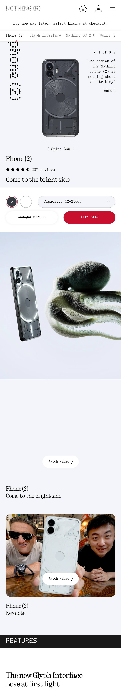

# Procesverslag
Markdown is een simpele manier om HTML te schrijven.  
Markdown cheat cheet: [Hulp bij het schrijven van Markdown](https://github.com/adam-p/markdown-here/wiki/Markdown-Cheatsheet).

Nb. De standaardstructuur en de spartaanse opmaak van de README.md zijn helemaal prima. Het gaat om de inhoud van je procesverslag. Besteedt de tijd voor pracht en praal aan je website.

Nb. Door *open* toe te voegen aan een *details* element kun je deze standaard open zetten. Fijn om dat steeds voor de relevante stuk(ken) te doen.

## Jij

  
uitwerken voor kick-off werkgroep

  ### Auteur:
  Felix Nierman
  #### Je startniveau:
  Rood

  #### Je focus:
  Responsive
 

## Je website

  
uitwerken voor kick-off werkgroep

  ### Je opdracht:
  https://nl.nothing.tech

  #### Screenshot(s) van de eerste pagina (small screen): 
  Nothing (Nederland) 
  

  #### Screenshot(s) van de tweede pagina (small screen):
  Nothing Phone (2) - Nothing (Nederland) - Nothing (Nederland)
  
 

## Toegankelijkheidstest 1/2 (week 1)

  
uitwerken na test in 2e werkgroep

  ### Bevindingen
  - Goede taal gebruikt
  - Knoppen niet heel uniek

  - Veel errors html
  - Kan niet zoomen op telefoon

  - Focus is op sommige knoppen niet heel duidelijk
  
  - Rotate goed
  - Balk met knoppen is te groot en neemt erg veel ruimte in, je kan niet goed scrollen of lezen.

  - Er worden geen h3'tjes gebruikt, maar niet zijn niet nodig

  - Lists zijn goed

  - Wel een alt attribute, maar er wordt niks mee gedaan

  - Als er een filmpje is, is het een link naar Youtube
  - Veel gifs in een soort carousel
  - Geen pauze knop (wel op Youtube)

  - Bijna geen button tags
  - focus is slecht

  - geen dark/light mode.
  - Bij hoog contrast veranderen de kleuren wel, maar de achtergrond van de knoppen verdwijnt helemaal

  - Er zijn amper animaties
  - Er is wel een prefers-reduced-animation

  - color contrast is goed
  - geen selection colors

## Breakdownschets (week 1)

  
uitwerken na afloop 3e werkgroep

  ### de hele pagina: 
  

  ### dynamisch deel section: 
  

## Voortgang 1 (week 2)

  
uitwerken voor 1e voortgang

  ### Stand van zaken
  Ik heb tot nu toe mijn html geschreven van mijn eerste pagina en ben nog niet begonnen aan mijn css.

  ### Agenda voor meeting
  samen met je groepje opstellen
  | Tim            | Bibi               | Soufiane     | Felix            |
  | ---            | ---                | ---          | ---              |
  | Keuze lastig responsive of surfaceplane | Typografie opdracht was lastig | HTML in orde? | Website raar ingedeeld    |
  | ---            | Misschien een andere website doen| ---          | HTML in orde?              |
  | ---            | ---                | ---          | ---              |
  | ---            | ---                | ---          | ---              |
  | ---            | ---                | ---          | ---              |
  | ---            | ---                | ---          | ---              |

  ### Verslag van meeting
  hier na afloop snel de uitkomsten van de meeting vastleggen

  - Een a kan in een h1
  - Kan verschillende navjes maken voor verschillende a'tjes
  - Dropdown hoeft niet, alleen als je tijd over hebt
  - Pop-up hoeft niet
  - De tekst naast je img kan gewoon een p zijn, is geen h2
  - ...

## Voortgang 2 (week 3)

  
uitwerken voor 2e voortgang

  ### Stand van zaken
  HTML pagina 1 helemaal af met footer ook. Begonnen css, footer nog niet af. Geen navigatie nog.

  ### Agenda voor meeting
  samen met je groepje opstellen
  | Tim            | Bibi               | Soufiane     | Felix            |
  | ---            | ---                | ---          | ---              |
  | ---            | ---                | ---          | Flex-box naar display grid?   |
  | ---            | ---                | ---          | Font opslaan?    |
  | ---            | ---                | ---          | ---              |

  ### Verslag van meeting
  hier na afloop snel de uitkomsten van de meeting vastleggen

  - Je kan een mediaquery gebruiken om je section display: grid; te maken.
  - Je kan je .otf font gewoon in een nieuw mapje zetten
  - Je kan het beste je bestand op github zetten door op upload te klikken en al je bestanden er in gooien.
  - Je deployment hoort gewoon automatisch te gaan.
  - ...

## Toegankelijkheidstest 2/2 (week 4)

  
uitwerken na test in 9e werkgroep

  ### Bevindingen
  - Mijn knoppen hebben nog dezelfde inhoud, maar betere focus en hover state.
  - Geen errors in mijn html, de echte website heeft heel veel errors.
  - Op mijn website kan je alle knoppen en linkjes gebruiken met een toetsenbord.
  - Werkt goed op mobiel, mijn menu gaat naar boven als je scrollt. De echte website is niet te gebruiken als je je telefoon draait.
  - al mijn img's hebben alt tekst. De echte website nergens.
  - Ik gebruik geen media dus ik hoef daar niks voor te maken.
  - Mijn controls zijn goed. Alle linkjes zijn a'tjes en button lijken ook echt op buttons.
  - We hebben allebei geen skip link, maar die hebben we niet nodig.
  - Mijn knopjes in mijn navigatie bovenin zijn niet te zien met high-contrast. Bij de echte website heeft geen enkele knop een background of border te zien met high-contrast.
  - ...

## Voortgang 3 (week 4)

  
uitwerken voor 3e voortgang

  ### Stand van zaken
  1e pagina 90% klaar. Navigatie in hamburgermenu met animatie. Responsive. Footer werkend.

  ### Agenda voor meeting
  samen met je groepje opstellen

  | Tim            | Bibi               | Soufiane     | Felix            |
  | ---            | ---                | ---          | ---              |
  | ---            | ---                | ---          | Klopt mijn footer?       |
  | ---            | ---                | ---          | Wat moet er van de tweede pagina in? |
  | ---            | ---                | ---          | ---              |
  | ---            | ---                | ---          | ---              |

  ### Verslag van meeting
  hier na afloop snel de uitkomsten van de meeting vastleggen

  - In je footer kan je de label gebruiken om je input klikbaar te maken.
  - Hoe ik een checkbox kan vormgeven.
  - Hoe je met grid-template-areas moet werken.
  - Niet alles van de tweede pagina hoeft er in. Je mag wat dingen weglaten.
  - ...

## Eindgesprek (week 5)

  
uitwerken voor eindgesprek

  ### Je uitkomst - karakteristiek screenshots:
  

  ### Dit ging goed/Heb ik geleerd: 
  - Ik kon heel fijn werken tijdens de lessen. De opdrachten leerden mij echt geweldig hoe ik dingen moest doen. Ik hoefde bijna niet eens het internet op om te zoeken hoe iets moest.
  - Ik heb geen enkele keer gebruik gemaakt van ChatGPT. Normaal gebruik ik die altijd als ik codeer. Nu was dat niet nodig.
  - Ik snap nu helemaal hoe flex-box en grid werkt.
  - Ik weet nu hoe GitHub werkt en vond het heel fijn dat ik versies terug kon bekijken.
  - Ik ben nu heel goed in de :nth-of-type() en andere selectors.
  - Uiteindelijk is het mij gelukt om mijn hele website responsive te maken.
  - Ik weet hoe grid-template-areas werkt. 

  

  ### Dit was lastig/Is niet gelukt:
  - Ik vond het erg lastig om het font werkend te krijgen. Uiteindelijk is het me gelukt.
  - Als ik meer tijd had, had ik de BUY NOW knop werkend gemaakt. Ik weet hoe het moet, maar ik had er geen tijd voor.
  - Als ik meer tijd had, had ik mijn body een max-width gegeven, maar dat alleen de content in het midden bleef. Ik kreeg het niet voor elkaar om de achtergrond en borders door te trekken naar de buitenkanten.
  - Het is mij niet gelukt om het plaatje van de telefoon draaibaar te maken. Ik heb het niet geprobeerd, maar dat wilde ik wel.

  

## Bronnenlijst

  
continu bijhouden terwijl je werkt

  Nb. Wees specifiek ('css-tricks' als bron is bijv. niet specifiek genoeg). 
  Nb. ChatGpT en andere AI horen er ook bij.
  Nb. Vermeld de bronnen ook in je code.

  1. Opdrachten op DLO.
  2. ...
  3. ...

